## Instal·lació del sistema operatiu

Aquesta instal·lació s'ha fet dins d'una **màquina virtual amb VirtualBox**,
no directament sobre l'ordinador físic: així es pot provar Ubuntu sense
arriscar les dades ni la resta de sistemes operatius ja instal·lats a
l'equip amfitrió. **Aquest procés reformata el disc virtual triat**, així
que en una instal·lació real cal revisar bé quin disc s'escull abans de
continuar.

### 1. Creació de la màquina virtual i el disc dur

Primer es crea una màquina virtual nova (`ubuntu26original`) i se li
assigna un disc dur virtual de 50 GB en format VDI, al costat de la
carpeta amb el contingut de la ISO d'Ubuntu ja descarregada.

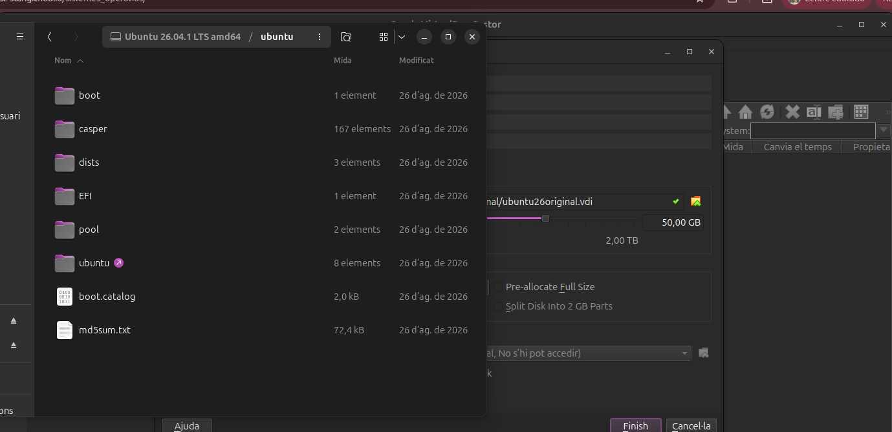

El gestor de màquines virtuals de VirtualBox mostra totes les màquines ja
creades a l'ordinador (Windows, Kali, altres proves d'Ubuntu) mentre es
defineix on es desarà el nou disc virtual.

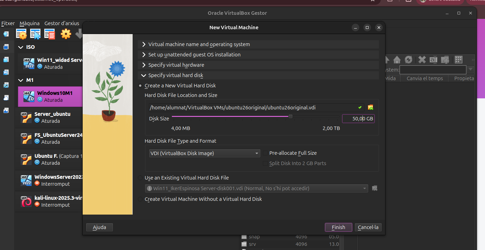

### 2. Maquinari assignat i identificació de la ISO

Es reserven **6064 MB de RAM** i **4 CPU** per a la màquina virtual: prou
recursos perquè Ubuntu funcioni amb fluïdesa sense deixar l'ordinador
amfitrió sense memòria.

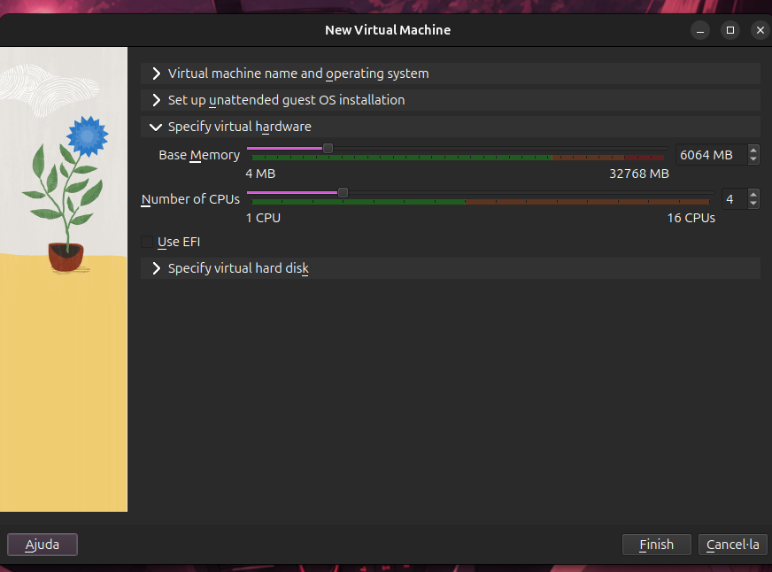

VirtualBox detecta automàticament, a partir de la imatge ISO seleccionada,
que es tracta d'Ubuntu i proposa el tipus de sistema operatiu
corresponent.

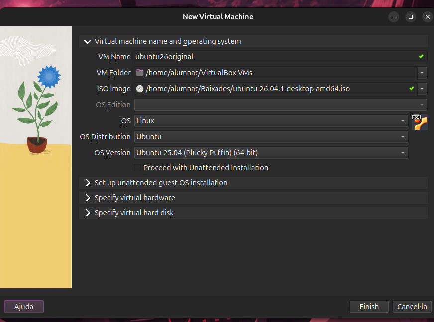

### 3. Primeres passes de l'instal·lador d'Ubuntu

Un cop arrencada la màquina virtual amb la ISO, s'inicia l'assistent
gràfic d'instal·lació d'Ubuntu. El primer pas és triar l'idioma:

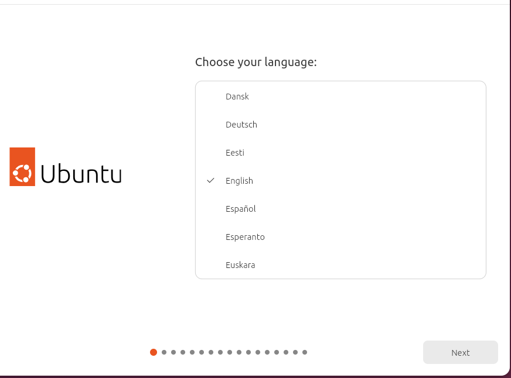

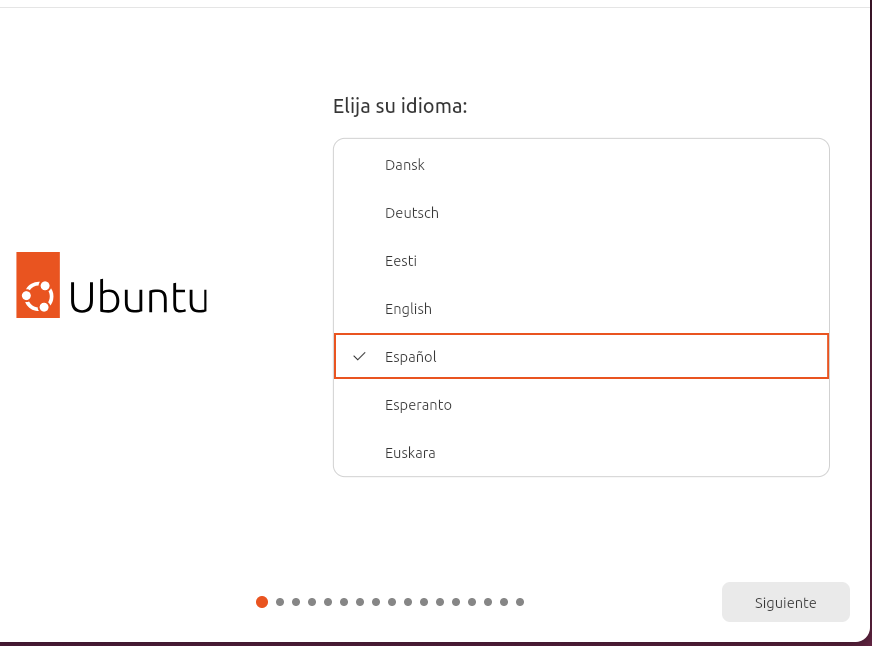

A continuació es tria la disposició del teclat:

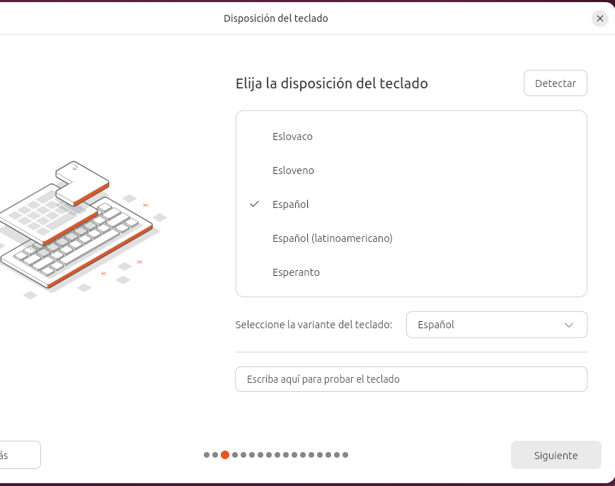

I es configura la connexió a Internet, en aquest cas per cable:

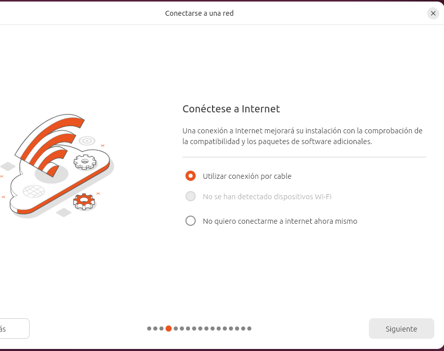

### 4. Tipus d'instal·lació i selecció d'aplicacions

L'instal·lador pregunta si es vol **instal·lar Ubuntu** o només
**provar-lo** sense fer canvis; en aquest cas es tria instal·lar-lo:

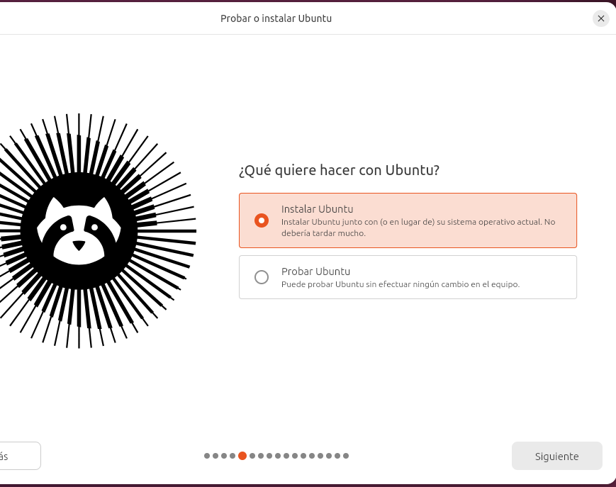

Es tria la instal·lació **interactiva** (pas a pas), en lloc d'una
instal·lació automatitzada amb un arxiu de configuració:

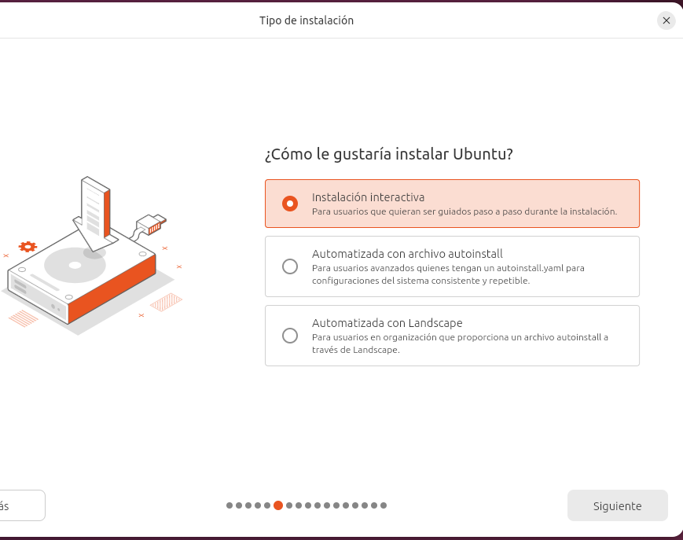

I es deixa la **selecció predeterminada** d'aplicacions (només el
navegador i les utilitats bàsiques):

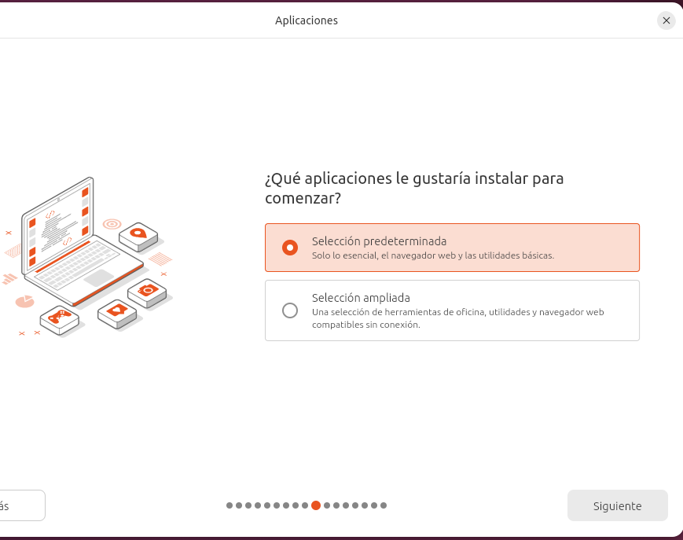

### 5. Configuració del disc i particionament manual

En comptes de deixar que l'instal·lador esborri el disc automàticament,
es tria la **instal·lació manual** per poder definir les particions a
mida:

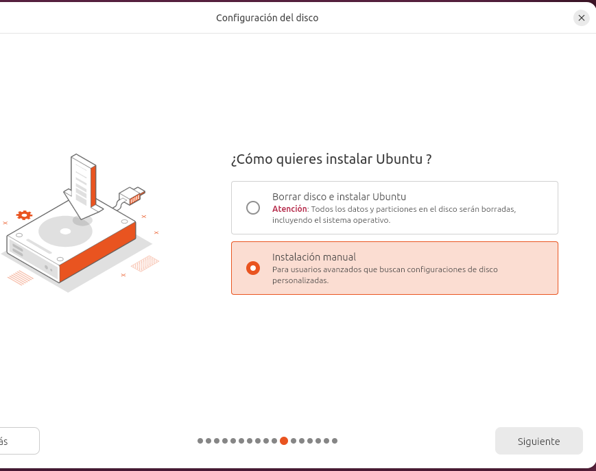

Es crea manualment cada partició indicant la mida, el sistema de fitxers
i el punt de muntatge; en aquest exemple, una partició de 30 GB en
format Ext4 muntada a `/home`:

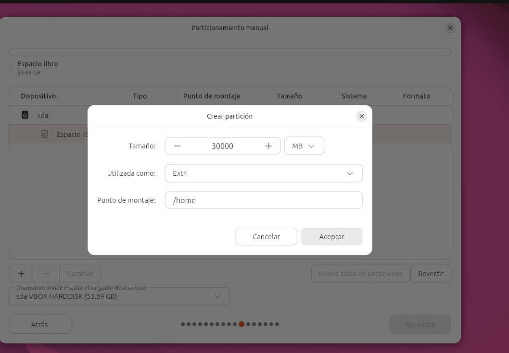

El resultat final és un disc amb tres particions: `/home` (30 GB), `/boot`
(500 MB) i `/` (23,18 GB), totes en Ext4:

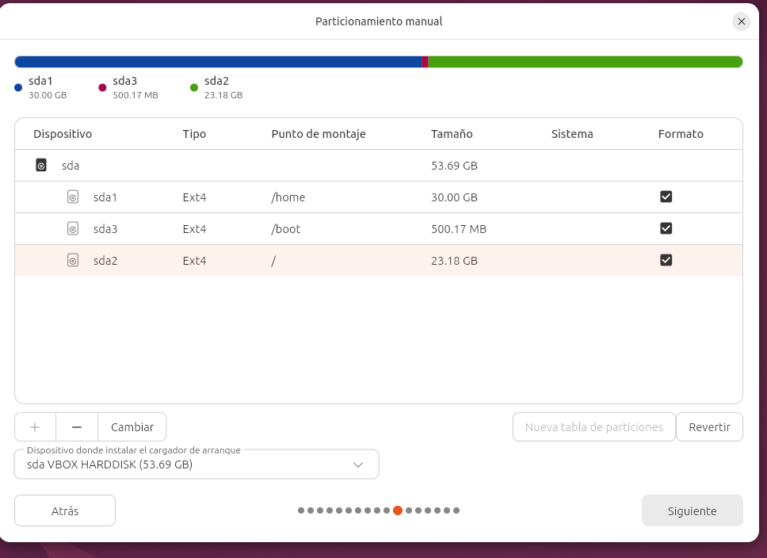

### 6. Creació del compte d'usuari i resum final

Es crea el compte de l'usuari que administrarà el sistema, amb el seu
nom, el nom de l'equip i una contrasenya:

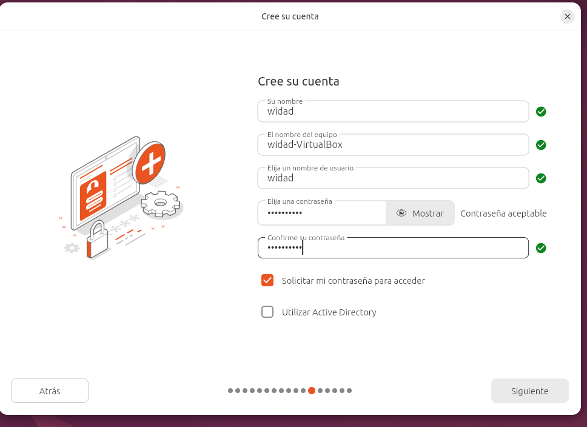

Finalment, l'instal·lador mostra un resum de totes les opcions triades
(instal·lació manual, disc VBOX HARDDISK, sense xifratge, i les tres
particions creades) abans de prémer **Instalar**:

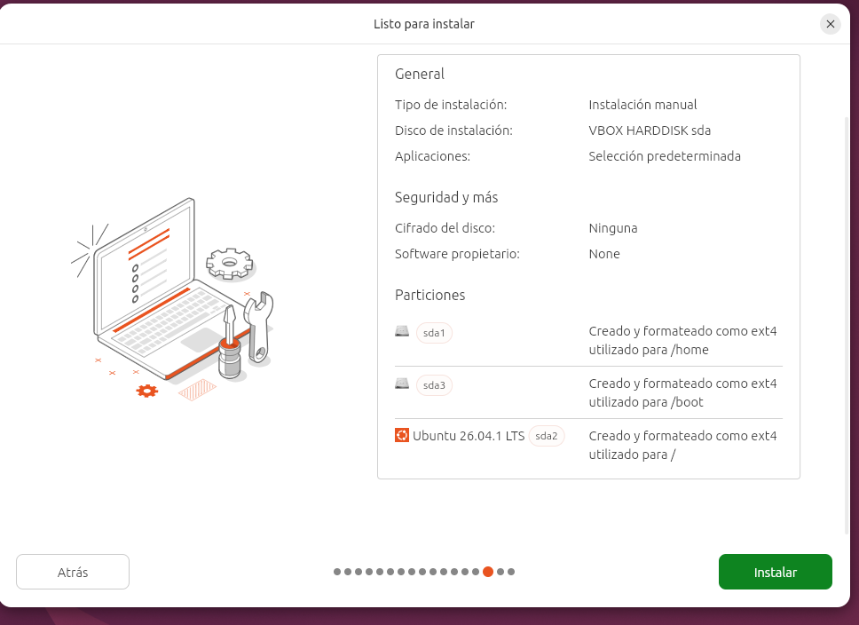

Un cop confirmat, l'instal·lador copia els arxius del sistema al disc
virtual i, en reiniciar la màquina, ja arrenca Ubuntu instal·lat.

## Configuració de xarxa bàsica

Ut enim ad minim veniam, quis nostrud exercitation ullamco laboris nisi
ut aliquip ex ea commodo consequat. La configuració de xarxa és
**imprescindible** per poder actualitzar el sistema i instal·lar
programari nou.

- Comprovar l'adreça IP assignada amb `ip a`.
- Configurar una IP estàtica si el servei ho requereix.
- Verificar la connectivitat amb `ping`.

Duis aute irure dolor in reprehenderit in voluptate velit esse cillum
dolore eu fugiat nulla pariatur. Excepteur sint occaecat cupidatat non
proident, sunt in culpa qui officia deserunt mollit anim id est laborum.

## Creació d'usuaris i grups

At vero eos et accusamus et iusto odio dignissimos ducimus qui
blanditiis praesentium voluptatum deleniti atque corrupti. Cada usuari
nou s'hauria d'assignar al **grup mínim necessari** segons les tasques
que ha de fer.

- Crear l'usuari amb `useradd`.
- Assignar contrasenya amb `passwd`.
- Afegir l'usuari als grups necessaris amb `usermod -aG`.

## Comprovació final

Et harum quidem rerum facilis est et expedita distinctio. Nam libero
tempore, cum soluta nobis est eligendi optio cumque nihil impedit.
Abans de donar per acabat el sprint, revisa aquest resum:

- El sistema arrenca sense errors.
- La xarxa respon correctament als _pings_.
- **Els usuaris i grups creats coincideixen amb l'enunciat.**

Nemo enim ipsam voluptatem quia voluptas sit aspernatur aut odit aut
fugit, sed quia consequuntur magni dolores eos qui ratione voluptatem
sequi nesciunt.
