## Instal·lació del sistema operatiu

Aquesta instal·lació s'ha fet dins d'una **màquina virtual amb VirtualBox**,
no directament sobre l'ordinador físic: així es pot provar Ubuntu sense
arriscar les dades ni la resta de sistemes operatius ja instal·lats a
l'equip amfitrió. **Aquest procés reformata el disc virtual triat**, així
que en una instal·lació real cal revisar bé quin disc s'escull abans de
continuar.

### 1. Creació de la màquina virtual i el disc dur

Primer es crea una màquina virtual nova (`ubuntu26original`) i se li
assigna un disc dur virtual de 50 GB en format VDI, al costat de la
carpeta amb el contingut de la ISO d'Ubuntu ja descarregada.

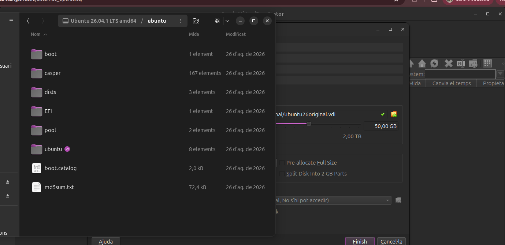

El gestor de màquines virtuals de VirtualBox mostra totes les màquines ja
creades a l'ordinador (Windows, Kali, altres proves d'Ubuntu) mentre es
defineix on es desarà el nou disc virtual.

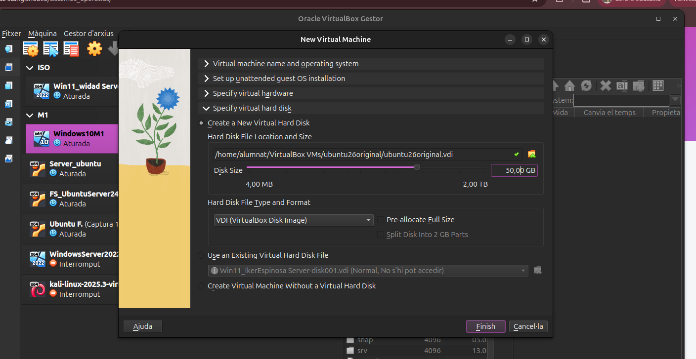

### 2. Maquinari assignat i identificació de la ISO

Es reserven **6064 MB de RAM** i **4 CPU** per a la màquina virtual: prou
recursos perquè Ubuntu funcioni amb fluïdesa sense deixar l'ordinador
amfitrió sense memòria.

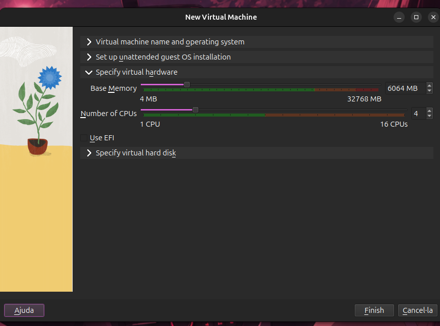

VirtualBox detecta automàticament, a partir de la imatge ISO seleccionada,
que es tracta d'Ubuntu i proposa el tipus de sistema operatiu
corresponent.

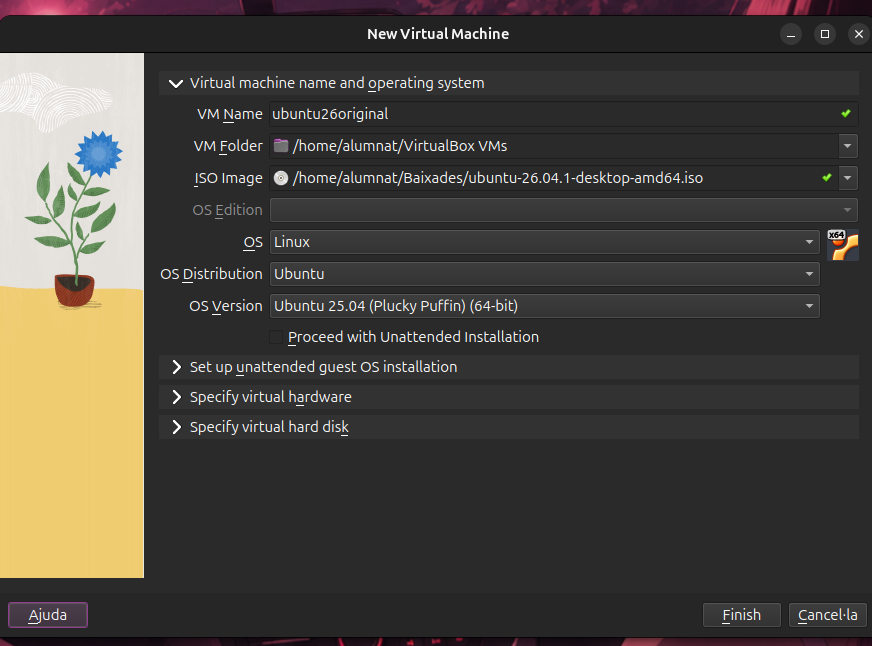

### 3. Primeres passes de l'instal·lador d'Ubuntu

Un cop arrencada la màquina virtual amb la ISO, s'inicia l'assistent
gràfic d'instal·lació d'Ubuntu. El primer pas és triar l'idioma:

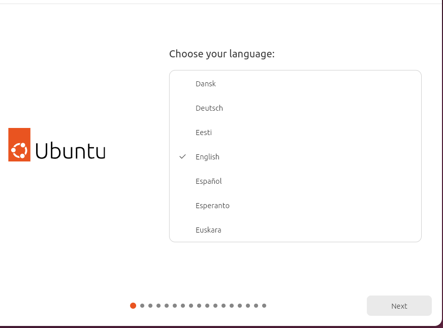

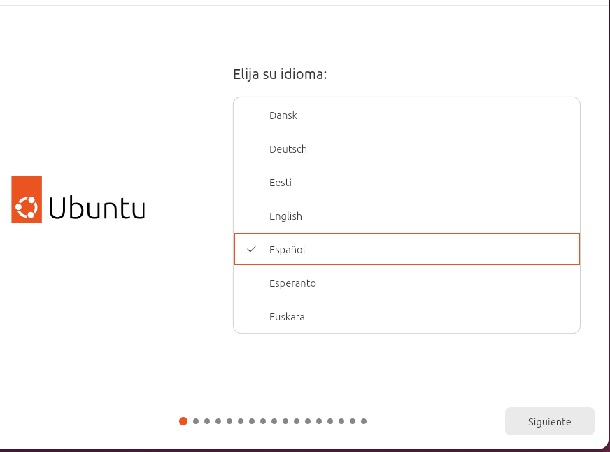

A continuació es tria la disposició del teclat:

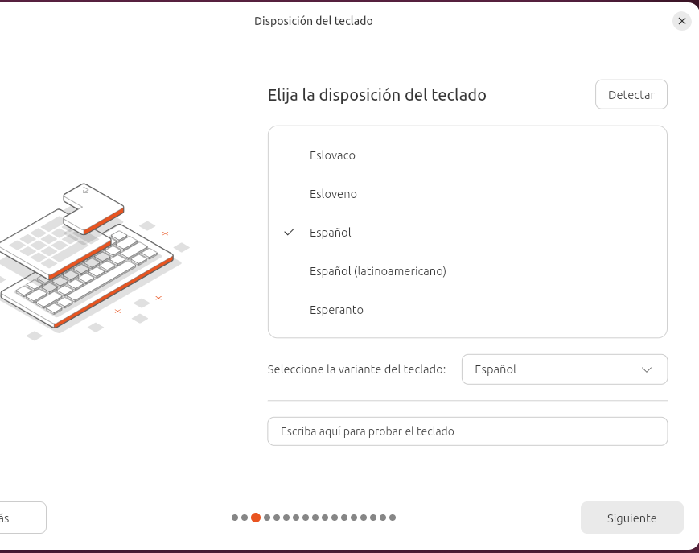

I es configura la connexió a Internet, en aquest cas per cable:

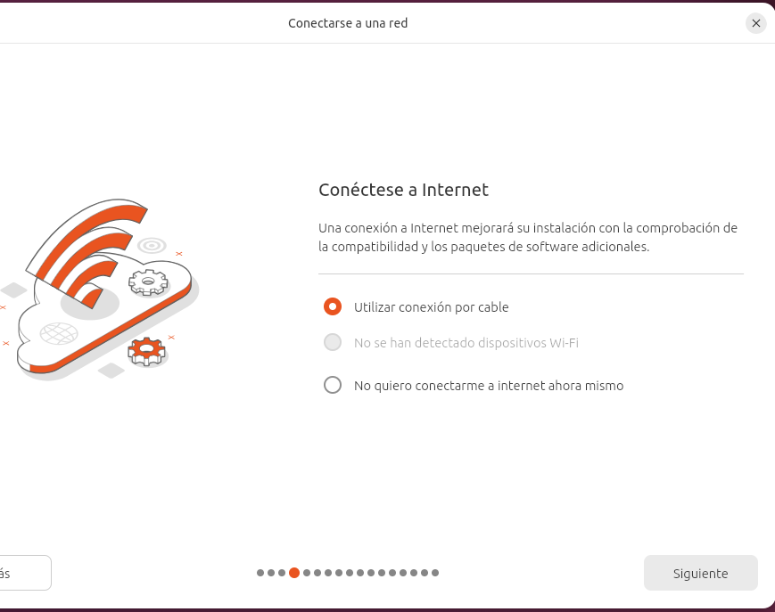

### 4. Tipus d'instal·lació i selecció d'aplicacions

L'instal·lador pregunta si es vol **instal·lar Ubuntu** o només
**provar-lo** sense fer canvis; en aquest cas es tria instal·lar-lo:

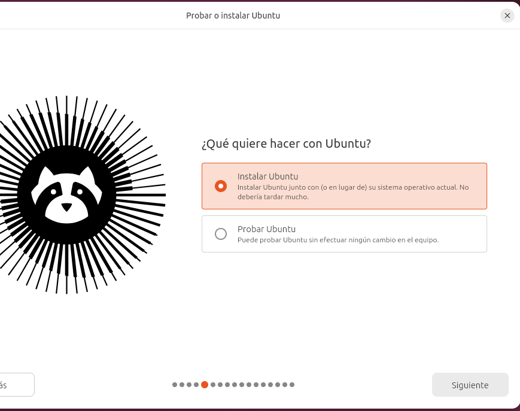

Es tria la instal·lació **interactiva** (pas a pas), en lloc d'una
instal·lació automatitzada amb un arxiu de configuració:

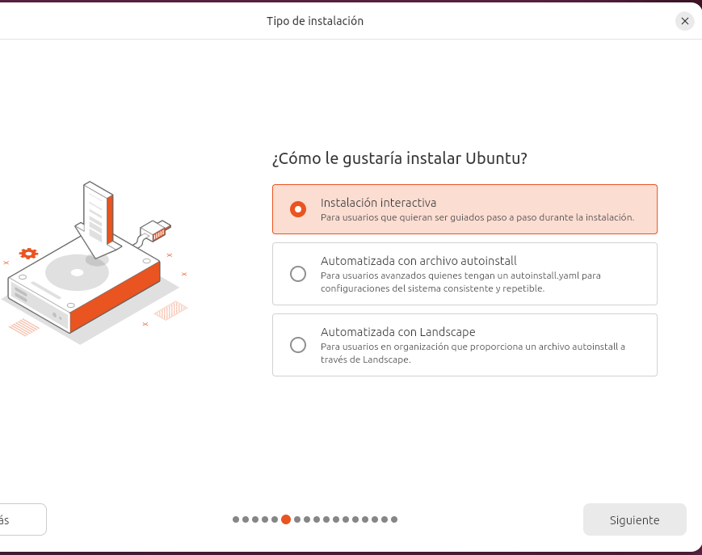

I es deixa la **selecció predeterminada** d'aplicacions (només el
navegador i les utilitats bàsiques):

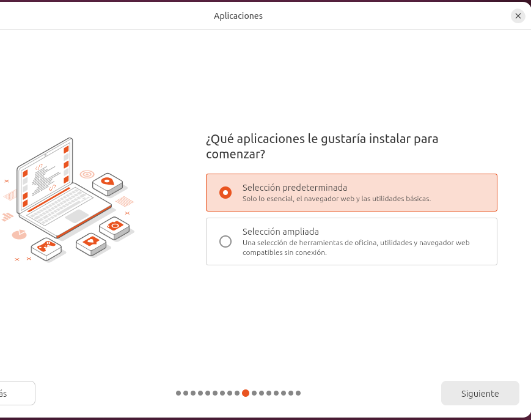

### 5. Configuració del disc i particionament manual

En comptes de deixar que l'instal·lador esborri el disc automàticament,
es tria la **instal·lació manual** per poder definir les particions a
mida:

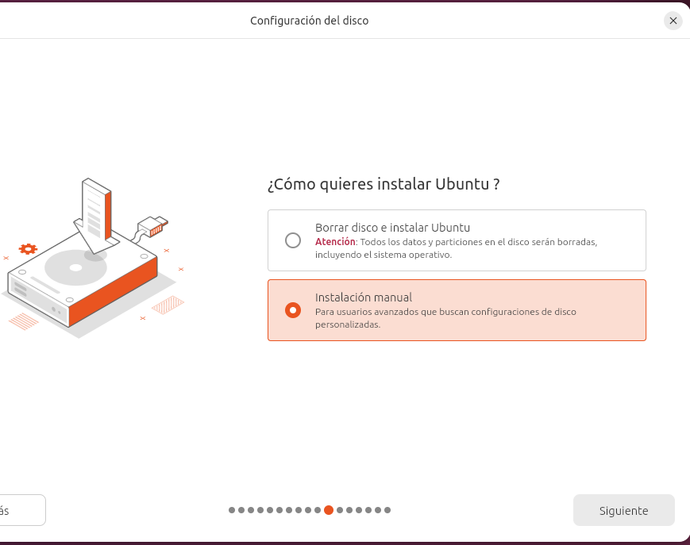

Es crea manualment cada partició indicant la mida, el sistema de fitxers
i el punt de muntatge; en aquest exemple, una partició de 30 GB en
format Ext4 muntada a `/home`:

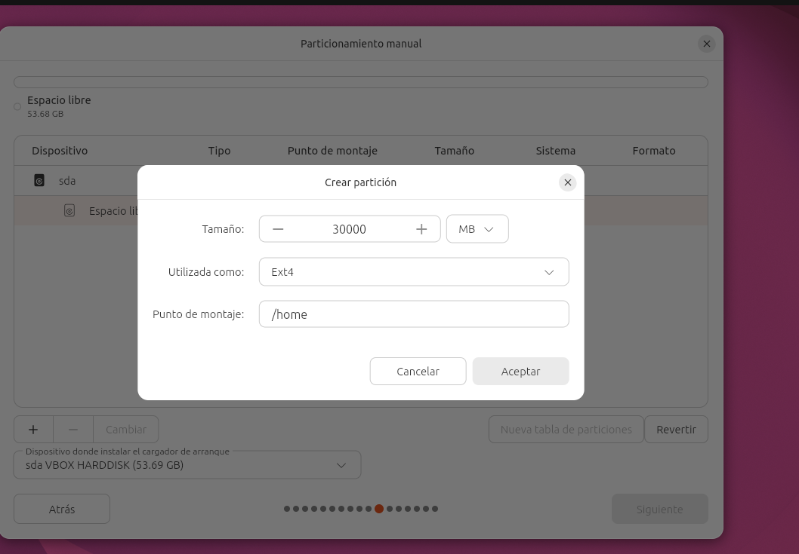

El resultat final és un disc amb tres particions: `/home` (30 GB), `/boot`
(500 MB) i `/` (23,18 GB), totes en Ext4:

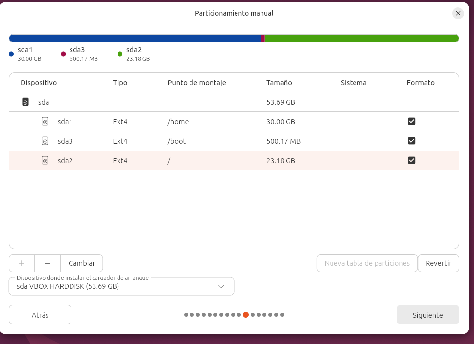

### 6. Creació del compte d'usuari i resum final

Es crea el compte de l'usuari que administrarà el sistema, amb el seu
nom, el nom de l'equip i una contrasenya:

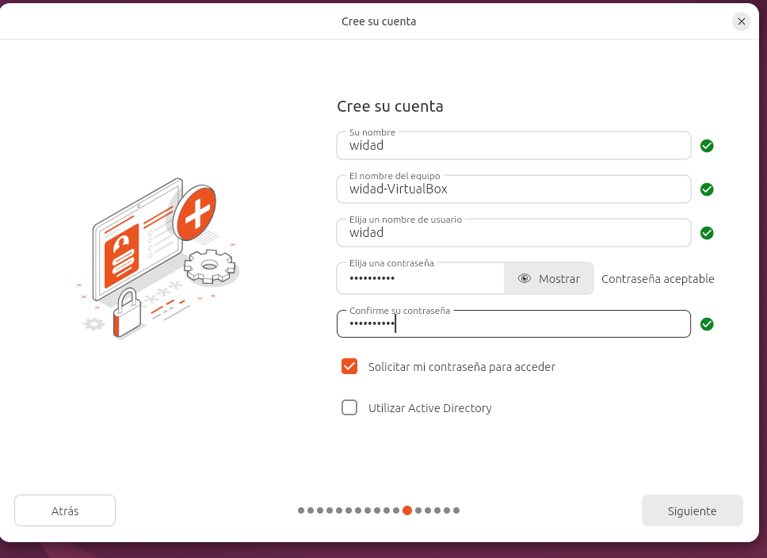

Finalment, l'instal·lador mostra un resum de totes les opcions triades
(instal·lació manual, disc VBOX HARDDISK, sense xifratge, i les tres
particions creades) abans de prémer el botó d'**instal·lar**:

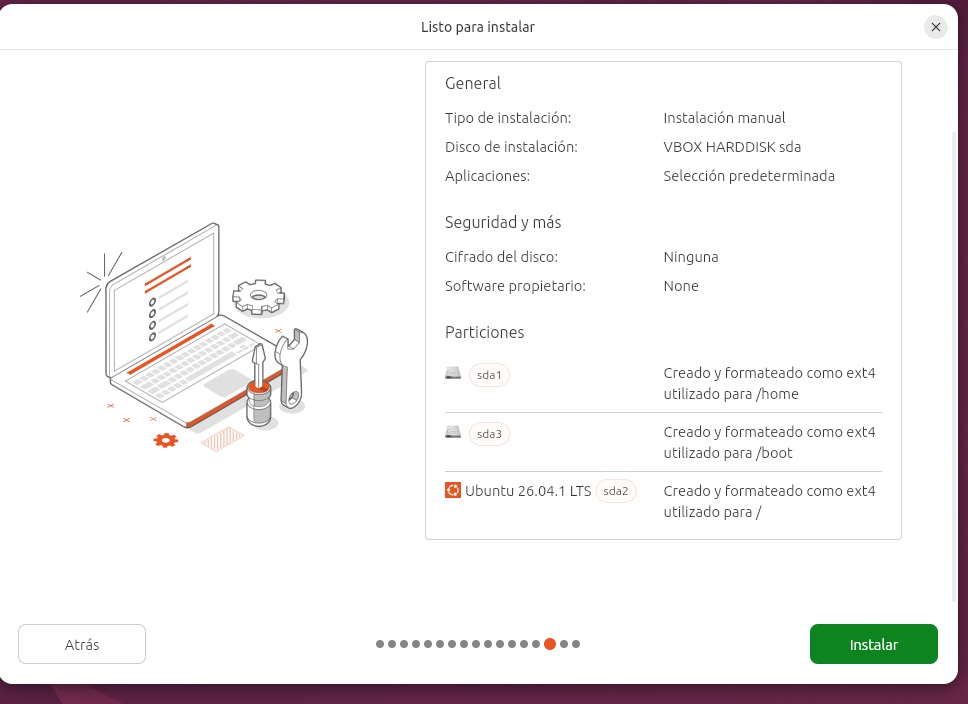

Un cop confirmat, l'instal·lador copia els arxius del sistema al disc
virtual i, en reiniciar la màquina, ja arrenca Ubuntu instal·lat.

## Configuració de xarxa bàsica

La configuració de xarxa és **imprescindible** per poder actualitzar
el sistema i instal·lar programari nou.

- Comprovar l'adreça IP assignada amb `ip a`.
  

- Configurar una IP estàtica si el servei ho requereix.
- Verificar la connectivitat amb `ping`.

*(Apartat pendent d'ampliar amb la pràctica real i captures.)*

## Creació d'usuaris i grups

Cada usuari nou s'hauria d'assignar al **grup mínim necessari** segons
les tasques que ha de fer.

- Crear l'usuari amb `useradd`.
- Assignar contrasenya amb `passwd`.
- Afegir l'usuari als grups necessaris amb `usermod -aG`.

## Gestió de paquets

Un cop instal·lat el sistema, cal saber instal·lar, actualitzar i
eliminar programari. A Ubuntu hi ha diverses eines per fer-ho, de més
a menys automàtiques.

### apt / apt-get

`apt` és el *frontend* modern del gestor de paquets `dpkg` (amb
millores respecte `apt-get`, l'eina més antiga).

**`apt update`** — Actualitza la llista de paquets disponibles,
mirant les adreces dels repositoris definides a
`/etc/apt/sources.list`. No instal·la ni actualitza res per si sol;
cal executar-lo sempre abans d'instal·lar o actualitzar, perquè el
sistema sàpiga quines versions existeixen.

**`apt upgrade`** — Actualitza els paquets que ja tens instal·lats a
la seva darrera versió disponible, però **no instal·la paquets
nous**. És la manera segura de mantenir el sistema al dia sense
sorpreses.

**`apt install paquet`** — Instal·la un paquet nou (per exemple,
`apt install synaptic`), descarregant-lo i instal·lant automàticament
totes les seves dependències.

**`apt remove paquet`** — Desinstal·la un paquet, però deixa els seus
arxius de configuració al sistema per si el tornes a instal·lar més
endavant.

**`apt autoremove`** — Esborra els paquets que es van instal·lar
automàticament com a dependència d'un altre paquet i que ara ja no fa
servir ningú; és bo executar-lo de tant en tant per netejar el
sistema.

### aptitude

Alternativa a `apt` (també té interfície gràfica a més de comandes).
La seva diferència principal és que **recorda les dependències** que
va instal·lar per a cada paquet: si després el desinstal·les, esborra
també aquestes dependències, sempre que cap altre paquet les faci
servir.

**`aptitude install paquet`** — Instal·la un paquet nou, igual que
`apt install`, però recordant quines dependències s'han instal·lat
només per culpa d'aquest paquet.

**`aptitude remove paquet`** — Desinstal·la el paquet i, si cap altre
en depèn, també les dependències que va instal·lar automàticament.

**`aptitude purge paquet`** — Fa el mateix que `remove`, però esborra
també tots els arxius de configuració del paquet.

**`aptitude show paquet`** — Mostra la informació d'un paquet
(versió, descripció, dependències...); si el paquet no està
instal·lat, t'ho indica igualment.

### dpkg

Eina de més baix nivell que `apt`: treballa directament amb arxius
`.deb` ja descarregats i **no resol dependències** per tu (si en
falta alguna, dóna error i cal instal·lar-la a mà amb `apt`).

**`dpkg -i arxiu.deb`** — Instal·la un paquet a partir d'un arxiu
`.deb` que ja tens al disc (per exemple, descarregat manualment des
d'una pàgina web).

**`dpkg -r paquet`** — Desinstal·la el paquet, deixant-ne la
configuració al sistema.

**`dpkg -P paquet`** — Purga el paquet: el desinstal·la i esborra
també tota la seva configuració.

**`dpkg -s paquet`** — Mostra l'estat i la prioritat del paquet
(`required`, `important`, `standard`, `optional` o `extra`), útil per
comprovar si un paquet concret està instal·lat.

**`dpkg --get-selections | grep paquet`** — Filtra la llista de tots
els paquets coneguts pel sistema per buscar-ne un en concret; si no
apareix cap resultat, és que no està instal·lat.

## Comprovació final

Abans de donar per acabat el sprint, revisa aquest resum:

- El sistema arrenca sense errors.
- La xarxa respon correctament als _pings_.
- **Els usuaris i grups creats coincideixen amb l'enunciat.**
